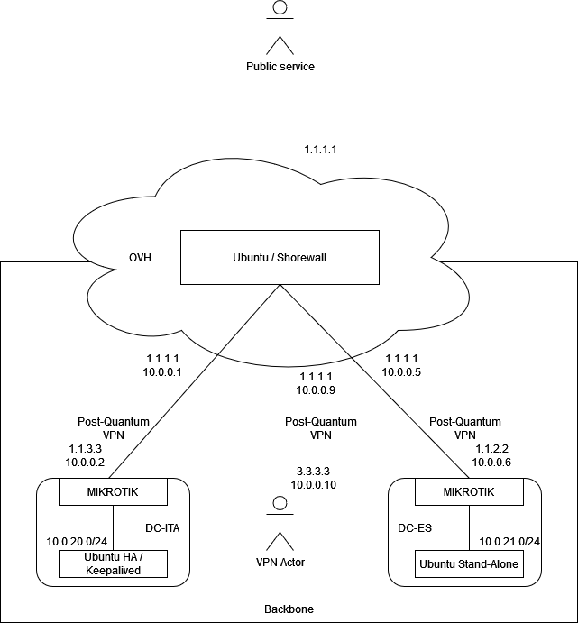

# home
A little project to describe my hybrid-home infrastructure based on Linux.

# Table of Contents
- [Overview](#overview)
- [Live demo](#live-demo)
- [OVH](#ovh)
  - [OVH/Ubuntu](#ubuntu-ovh)
- [DC-ITA](#dc-ita)
  - [DC-ITA/MIKROTIK](#mikrotik-ita)
  - [DC-ITA/UBUNTU](#ubuntu-ita)
- [DC-ES](#dc-es)
  - [DC-ES/MIKROTIK](#mikrotik-es) 
  - [DC-ES/UBUNTU](#ubuntu-es)
- [Stats](#stats)
- [Stack](#stack)
- [VPN users](#vpn-users)

## Overview
Overview of my home infrastructure.

<p align="center">
  
</p>

## Live demo
I written a minimalist HTTP tool to dynamically fetch data from MIKROIKs devices and securely expose my backbone.

Please visit [https://public-ip](https://public-ip).

The tool only use a bit of javascript to print the data and you can check how minimalistic is by running:

```
curl https://<public-ip>/reader/10.150.0.2 --insecure > minimalistic-detail.txt
```

In the index page javascript is not present.

## OVH
Main VPS data center.
Running minimal services and mainly used as load-balancer or vpn-aggregator.

### Ubuntu-OVH
Machine mainly used as Firewall - with SHOREWALL - and as VPN-aggregator - with WIREGUARD - to manage backbone network. 
Performing NAT (MASQ, 1:1), policies and security controls. 

Is very simple to setup a VPN-aggregator with systemd:
```
interface=wg01
systemctl enable wg-quick@$interface
systemctl start wg-quick@$interface
```

Running a DNS service to manage backbone's domain names and dns-leak for vpn's users.

Can also run front-end applications.

## DC-ITA
On premises DC located in Italy, running backend services and secured with MIKROTIK.

```
N*2 MIKROTIK Router
N*2 MIKROTIK Access Point
N*1 ZYXEL Managed Switch
N*2 Pine64 (ROCK64 and Pine64)
```

### MIKROTIK-ITA
Post-Quantum WIREGUARD peer that interconnect DC-ITA with OVH.

Managing only one PPPoE interface with one Public IP, two MIKROIKs (on/off switch script on MIKROTIK to manage fail-over); also running VRRP on LAN interfaces to serve local infrastructure.

Managing local "family" network with CAPsMAN (2 APs), VLAN (access and trunk mode) and security policies.

### UBUNTU-ITA
Running backend services clustered with Keepalived VRRP (keepalived.org).

Some examples could be: CockroachDB, Elastic Search or even REDIS.

## DC-ES
On premises DC located in Spain, running backend services.

```
N*1 MIKROTIK Router
N*1 RASPERRY PI
```
### MIKROTIK-ES
Post-Quantum WIREGUARD peer that interconnect DC-ES with OVH.

### UBUNTU-ES
Running backend services.

Also used as AMG (Advanced Management Gateway) with others VPNs (IPSEC or SSL); this gateway could be used as transit gateway or - in case - as jump server: I'm running my job's VPN client in this server (with vpnc) and i'm able to access to wole services (even customers zones).

## Stats
Example of pings between DCs.

### ES-to-OVH
```
root@ubuntu:/home/ubuntu# ping 10.150.0.5 -c100
PING 10.150.0.5 (10.150.0.5) 56(84) bytes of data.
[...]

--- 10.150.0.5 ping statistics ---
100 packets transmitted, 100 received, 0% packet loss, time 99150ms
rtt min/avg/max/mdev = 32.783/33.153/33.601/0.115 ms

```

### ES-to-ITA
```
root@ubuntu:/home/ubuntu# ping 10.0.20.6 -c100
PING 10.0.20.6 (10.0.20.6) 56(84) bytes of data.
[...]

--- 10.0.20.6 ping statistics ---
100 packets transmitted, 100 received, 0% packet loss, time 99146ms
rtt min/avg/max/mdev = 55.265/70.383/101.775/7.329 ms
```

## Stack
All infrastructure is aligned with the following stack:

```
Operative system: UBUNTU
Operative system firewall: SHOREWALL
Operative system HA: Keepalived (keepalived.org)
Operative system SSH opts: no-pwd,no-root,key_auth,strict
Perimetral firewall: MIKROTIK
Load-balancing: HAProxy
VPN: WIREGUARD (with both symmetric and asymmetric keys)
Scripts main language: PYTHON
```

## VPN users
Some VPN users are also able to use the infrastructure to masquerade their IP (thanks kernel ip forwarding).
