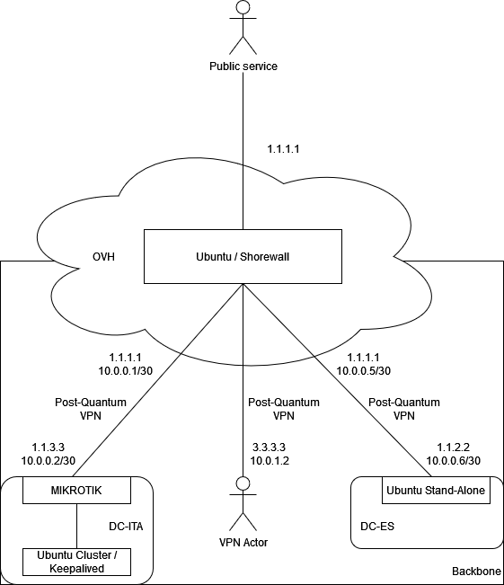

# home
Overview of my home infrastructure.

<p align="center">
  
</p>

## OVH
Main VPS data center.
Running minimal services and mainly used as load-balancer or vpn-aggregator.

### Ubuntu
Machine mainly used as Firewall - with SHOREWALL - and as VPN-aggregator - with WIREGUARD - to manage backbone network. 
Performing NAT (MASQ, 1:1), policies and security controls. 

Is very simple to setup a VPN-aggregator with systemd:
```
interface=wg01
systemctl enable wg-quick@$interface
systemctl start wg-quick@$interface
```

Running a DNS service to manage backbone's domain names and dns-leak for vpn's users.

Can also run front-end applications.

## DC-ITA
Located in Italy, running backend services and secured with MIKROTIK.

```
N*2 MIKROTIK Router
N*2 MIKROTIK Access Point
N*1 ZYXEL Managed Switch
N*2 Pine64 (ROCK64 and Pine64)
```

### MIKROTIK
Post-Quantum WIREGUARD peer that interconnect DC-ITA with OVH.

Managing only one PPPoE interface with one Public IP, two MIKROIKs (on/off switch script on MIKROTIK to manage fail-over); also running VRRP on LAN interfaces to serve local infrastructure.

Managing local "family" network with CAPsMAN (2 APs), VLAN (access and trunk mode) and security policies.

### Ubuntu cluster
Running backend services clustered with Keepalived VRRP (keepalived.org).

Some examples could be: CockroachDB, Elastic Search or even REDIS.

## DC-ES
Located in Spain, running backend services and still not secured with MIKROTIK.

```
N*1 RASPERRY PI
```

### Ubuntu stand-alone
Post-Quantum WIREGUARD peer that interconnect DC-ES with OVH.

Also used as AMG (Advanced Management Gateway) with others VPNs (IPSEC or SSL); this gateway could be used as transit gateway or - in case - as jump server: I'm running my job's VPN client in this server (with vpnc) and i'm able to access to wole services (even customers zones).

# Stack
All infrastructure is aligned with the following stack:

```
Operative system: UBUNTU
Operative system firewall: SHOREWALL
Operative system HA: Keepalived (keepalived.org)
Operative system SSH opts: no-pwd,no-root,key_auth,strict
Load-balancing: HAProxy
VPN: WIREGUARD (with both symmetric and asymmetric keys)
Scripts main language: PYTHON
```

# Routes and NAT
Linux systems enable administrator to route requests between interfaces.

## Route
If you want to route an external range, add the route to the aggregator:
```
ip route add 10.77.5.0/24 dev wg2
```

## NAT
To configure a symmetric NAT between two different VPN interfaces:

```
iptables -t nat -A PREROUTING -i wg0 -d 10.11.33.0/24 -j NETMAP --to 10.12.34.0/24
iptables -t nat -A POSTROUTING -o wg0 -d 10.12.34.0/24 -j NETMAP --to 10.11.33.0/24
iptables -t nat -A POSTROUTING -s 10.0.0.0/24 -d 10.12.34.0/24 -o tun0 -j MASQUERADE
iptables -A FORWARD -i wg0 -o tun0 -j ACCEPT
iptables -A FORWARD -i tun0 -o wg0 -j ACCEPT
```

### Symmetric NAT limitations
When you configure a symmetric NAT rule in SHOREWALL, it will be translated into the following SNAT and DNAT iptables rules:

```
iptables -t nat -A PREROUTING -d 10.11.33.1 -i wg0 -j DNAT --to-destination 10.12.34.1
iptables -t nat -A POSTROUTING -s 10.12.34.1 -o wg0 -j SNAT --to-source 10.11.33.1
```

So, if you want to perform a symmetric nat to a whole range, you need to manually configure iptables with NETMAP action (```-j NETMAP```) as described before.

# VPN and Public IP
Some VPN actors are also able to use the infrastructure to masquerade their IP (thanks kernel ip forwarding!).
